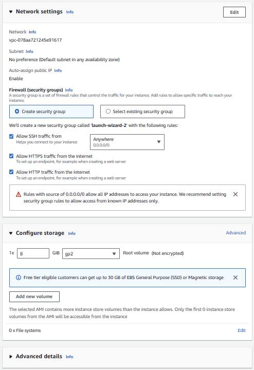
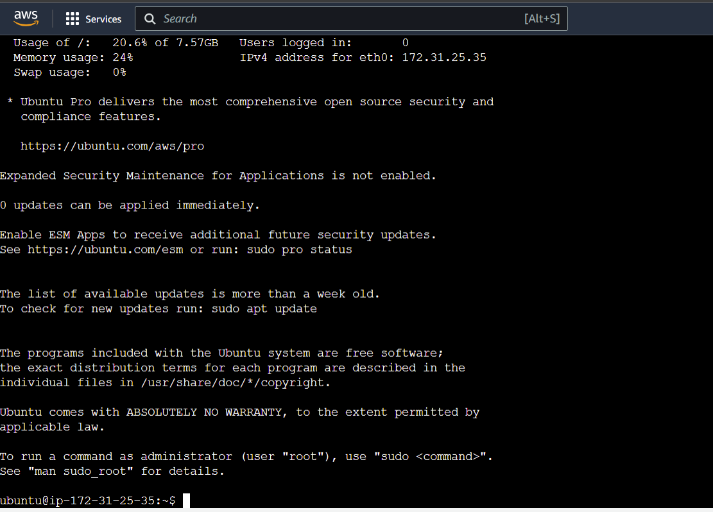
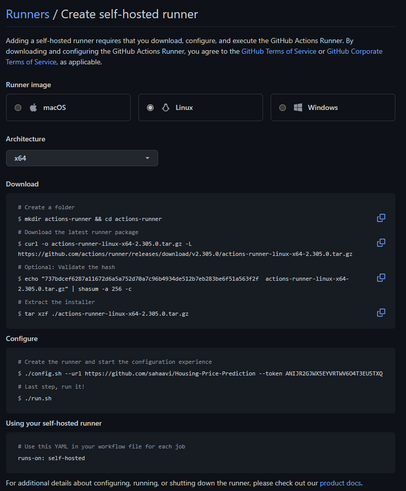
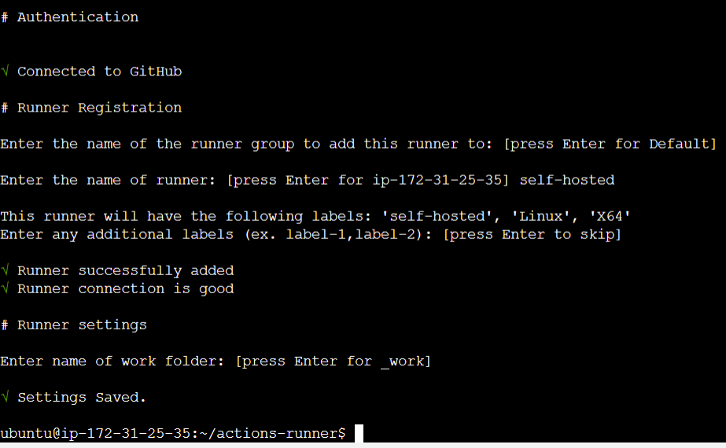

# Predicting Housing Prices using Machine Learning

This project is an end-to-end machine learning project that involves building a model to predict housing prices using the California Housing dataset. The project covers all stages of a typical machine learning project, including data exploration, preparation, feature engineering, model selection and evaluation, and deployment.

## Package Details

**requirements.txt**
> Here `-e .` will triger the setup.py file.

**components**
> This sub-package is for data ingestion, transformation and model training.  
`data_ingestion` Data ingestion is the process of importing large, assorted data files from multiple sources into a single, cloud-based storage medium—a data warehouse, data mart or database—where it can be accessed and analyzed. Also use this module to split the dataset into train and test.  
`data_transformation` Data transformation is the process of converting data from one format or structure into another format or structure. For example, change categoriacal features into numerical features, one hot encoding, label encoding.  
`model_trainer` Here we'll train our models

**pipeline**
> This sub-package is for pipeline. We'll use two pipelines.  
> - `train_pipeline` This module is for training pipeline. This will triger the modules of components. 
> - `predict_pipeline` This module is for prediction purpose. 

**logger.py**

> Deals with logging. In commercial software products logging is actually crucial because logging allows to detect bugs sooner, it allows to traceback easily when a problem occurs.

**exception.py**

> Deals with exception handling.  
`exc.info()` This function returns the old-style representation of the handled exception. If an exception e is currently handled (so exception() would return e), exc_info() returns the tuple (type(e), e, e.\__traceback__). That is, a tuple containing the type of the exception (a subclass of BaseException), the exception itself, and a traceback object which typically encapsulates the call stack at the point where the exception last occurred.  
If no exception is being handled anywhere on the stack, this function return a tuple containing three None values.

**utils.py**

> Store common funtions to use anywhere in the app. We'll basically try to use these function inside the components modules.

## GitHub & AWS CI/CD
* jobs
    * Continuous Integration: Run all the unit test cases before building
    * Build & Push ECR Image: AWS ECR is used to store, manage & deploy docker containers. From ECR the docker image will be deployed to the EC2 instance.

## AWS
First of all we have to create the ECR.  

Create EC2 Instance  
   
  
Then launch the instance.  
After that connect to that instance.


After get connected you'll get the screen like this

Then clear the screen by `clear` command.  
Next update the packages. The command below updates the package list and metadata of the package manager. `sudo` is used to run the command in the root directory of linux machine.
```
sudo apt-get update -y
```
The command below upgrades all the installed packages to their latest version.
```
sudo apt-get upgrade
```
Install necessary packages that are required for dockers in the linux machine. Excute the commands below one by one.
```
curl -fsSL https://get.docker.com -o get-docker.sh
sudo sh get-docker.sh
sudo usermod -aG docker ubuntu
newgrp docker
```
<details>
<summary>Click here to see the details explanation of above code chunk</summary>
`curl -fsSL https://get.docker.com -o get-docker.sh`: This command uses the curl utility to download the Docker installation script from https://get.docker.com and save it as a file named get-docker.sh in the current directory. The -fsSL flags are used to specify the desired options for the curl command:

- f: Fail silently and return an error code if the HTTP request fails.
- s: Silent mode, which suppresses the progress meter.
- S: Show error if the HTTP request fails.
- L: Follow redirects if the server responds with a redirect.  

`sudo sh get-docker.sh`: This command executes the get-docker.sh script using the sh interpreter, which installs Docker on the EC2 instance. The sudo command is used to run the script with administrative privileges, as installing Docker typically requires root access. Running this command will initiate the Docker installation process.

sudo usermod -aG docker ubuntu: This command modifies the user ubuntu by adding it to the docker group. By adding the user to the docker group, it grants the user the necessary permissions to interact with Docker without needing to use sudo for every Docker command. This ensures that the user ubuntu can manage Docker containers and images.

newgrp docker: This command starts a new shell session with the docker group as the primary group. This is done to ensure that the group membership changes made in the previous command take effect immediately. By starting a new shell session, any subsequent Docker commands executed by the user ubuntu will have the appropriate group permissions applied.
</details>

Then check whether the docker is running or not in the EC2 instance by `docker` command.

## GitHub Settings
Goto settings and click on Actions on the left bar. Now we have to create runner. Whenever we will commit any changes to this repository this runner will be triggered and execute the deployment process.  
If you click on create new runner and choose Linu you'll be able to see something like the screenshot below.  

Copy, paste and excute each line of code on the EC2 instance.

After Creating the runner and start the configuration experience it will ask to enter the name of the runner group we can just hit enter to skip this. Next it will ask to enter the name of the runner. We can name it self-hosted and hit enter. You can follow the following screenshot:


## APP

Prediction Result


## Acknowledgments

Some steps of this project built by following the steps provided in the book "[Hands-On Machine Learning with Scikit-Learn and TensorFlow](https://www.oreilly.com/library/view/hands-on-machine-learning/9781491962282/)" by [Aurélien Géron](https://github.com/ageron). The book provided clear and detailed explanations of each step, along with practical tips and best practices, and it used popular libraries such as Pandas, NumPy, Scikit-Learn, and TensorFlow to implement the code. 

Book GitHub repo link: https://github.com/ageron/handson-ml3